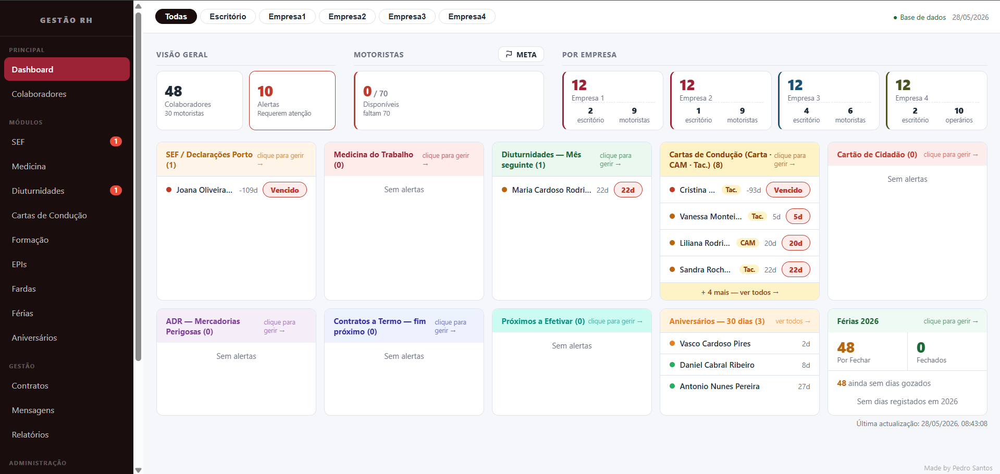
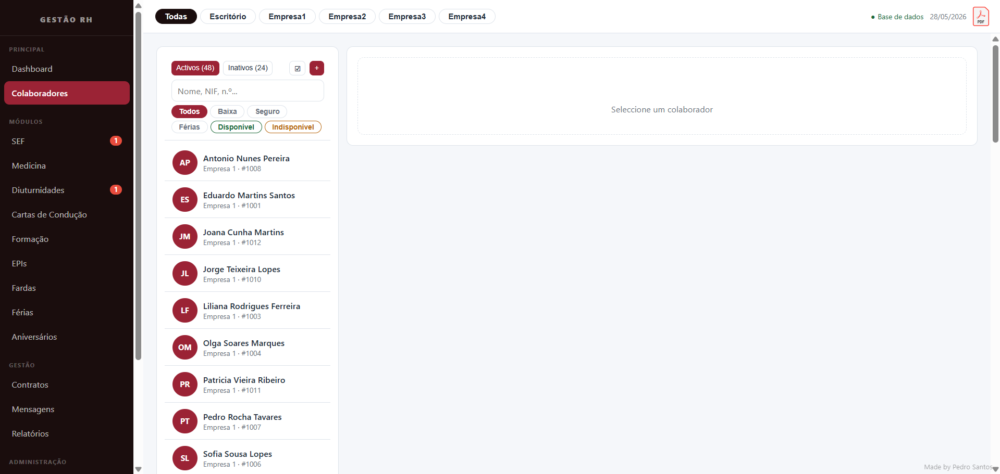
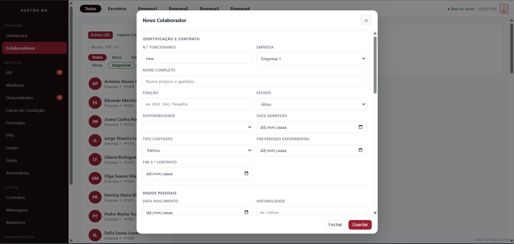
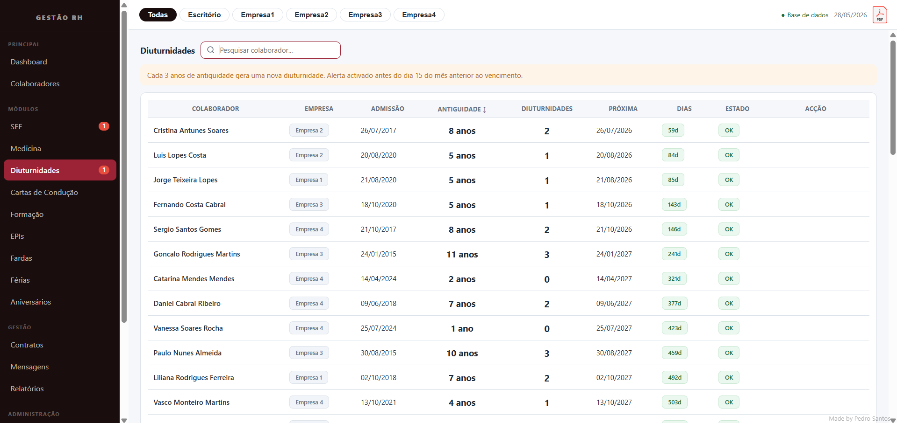
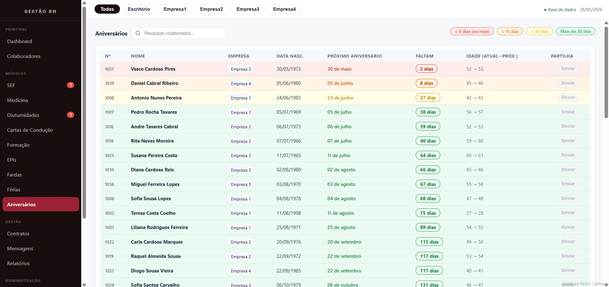
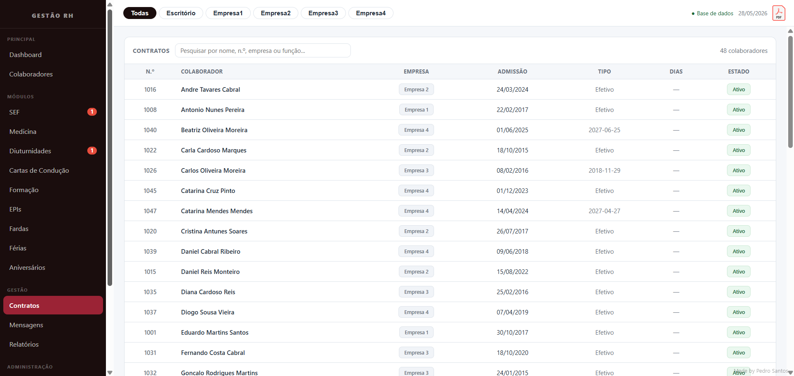
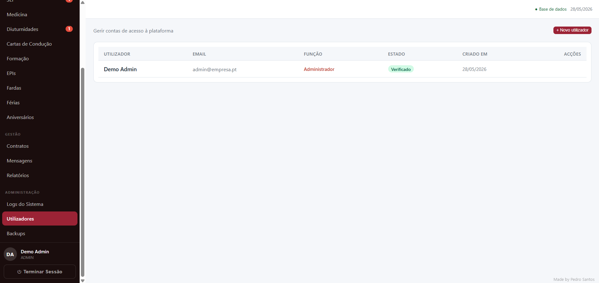

# HR Manager

[](https://github.com/PedroSantos1219/HR-Management-System/actions/workflows/php-lint.yml)
[](./LICENSE)

In-house HR application for a small fleet operator. Tracks staff,
contracts, documents, PPE and uniform stock, training, vacations, plus
reminders for medical exams and driving licences. Runs on a single XAMPP
install in the office, served over the local network.



## Stack

- React 18 + Babel Standalone, loaded straight from a CDN. JSX is
  compiled in the browser — there is no build step on purpose.
- PHP 8.1+ with PDO SQLite. No Composer, no framework.
- SQLite in a single file, with a daily backup task and a restore button
  in the UI.
- A small SMTP client in `mailer.php` (STARTTLS or implicit SSL). Used
  for account verification, password reset and admin 2FA codes.
- CSS split into base / layout / components / modules under `css/`.

## Local setup

```
cd C:\xampp\htdocs
git clone https://github.com/PedroSantos1219/HR-Management-System.git
cd HR-Management-System
copy config.example.php config.php
```

Open `config.php` and fill in the SMTP credentials, the list of super
admins and the seed users. The seed users are inserted on the first run
when the database is empty.

To make the daily backup happen automatically, schedule the script in
Windows Task Scheduler:

```
C:\xampp\php\php.exe "<full path>\backup_cron.php"
```

If that task ever fails, `api.php` has a fallback that creates the
backup on the first login of the day.

For the full office LAN setup (static IP, firewall, restoring across
machines) see [`docs/DEPLOY.md`](./docs/DEPLOY.md). Before opening the
server to the rest of the office, read [`docs/SECURITY.md`](./docs/SECURITY.md) —
the NTFS permissions section in particular.

## Project layout

```
index.html             React SPA — Dashboard, employees, modules, PDFs
api.php                POST/GET endpoints, all server-side logic
security.php           CSRF, security headers, sessions, screenshots
mailer.php             minimal SMTP client
backup_cron.php        daily backup runner
excel_manager.html     standalone Excel export tool
config.example.php     template — copy to config.php
css/                   base, layout, components, modules
js/                    helpers and screens extracted from index.html
uploads/               documents uploaded by users (gitignored)
backups/               SQLite snapshots (gitignored)
```

`config.php`, `rh_manager.sqlite`, `uploads/` and `backups/` are
gitignored. So is the real `EXCEL/` folder with company data.

## Notes worth knowing

- **No build step**: the first page load is heavier (Babel compiles JSX
  on the fly) but it avoids a whole pipeline. Trade-off was made on
  purpose for a small in-house tool.
- **Global state lives in the `App` component**. Plain `useState` is
  enough — there is no Redux or Zustand and there shouldn't be.
- **Optimistic locking on `save_data`**: every write checks
  `__dataVersion__` against the last value the client saw. If two people
  edit at the same time, the second `save` is rejected and the page
  reloads with a clear message rather than silently overwriting.
- **Backup restore closes the SQLite connection before the file copy**
  because Windows holds an exclusive lock on the file otherwise.
- **Daily migration in `applyDataMigrations()`** quietly cleans up
  legacy inconsistencies from older Excel imports each time data is
  loaded or saved.

## License

MIT — see [`LICENSE`](./LICENSE).

---

### 🇵🇹 Imagens da aplicação

Capturas com dados fictícios (empresas anonimizadas como "Empresa 1–4"
e colaboradores gerados aleatoriamente):

| Dashboard | Colaboradores |
|---|---|
|  |  |

| Novo Colaborador | Diuturnidades |
|---|---|
|  |  |

| Aniversários | Contratos |
|---|---|
|  |  |

| Utilizadores |
|---|
|  |

### 🇵🇹 Resumo

Aplicação interna de gestão de RH para uma pequena transportadora.
Corre em XAMPP local servido na rede interna do escritório. PHP 8 +
SQLite + React 18 carregado via CDN, sem build step. Edita o
`config.php` (SMTP, super_admins, default_users, lista de empresas) e
abre no browser através do XAMPP.
